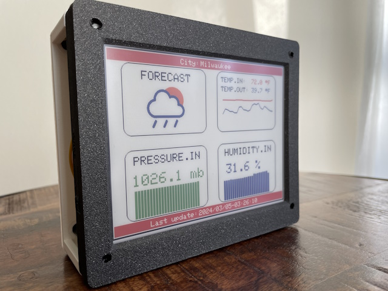
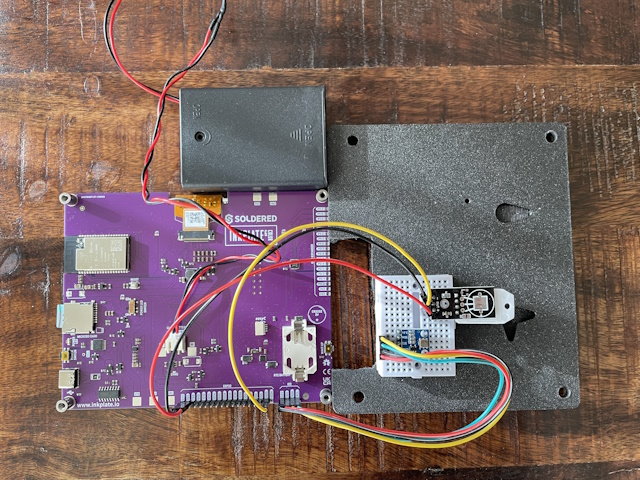
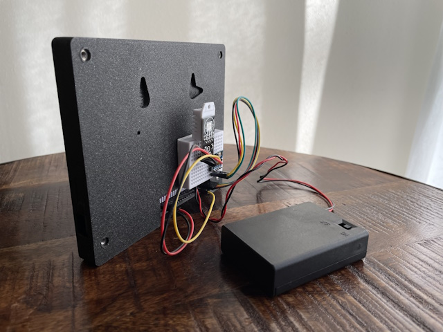
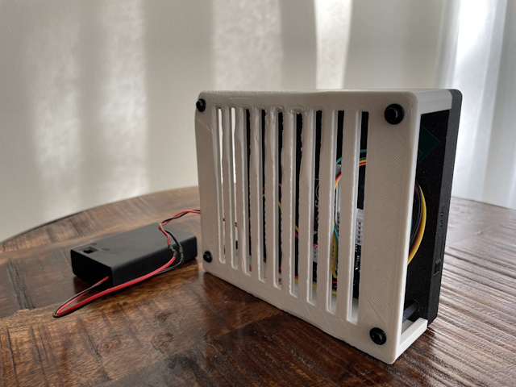
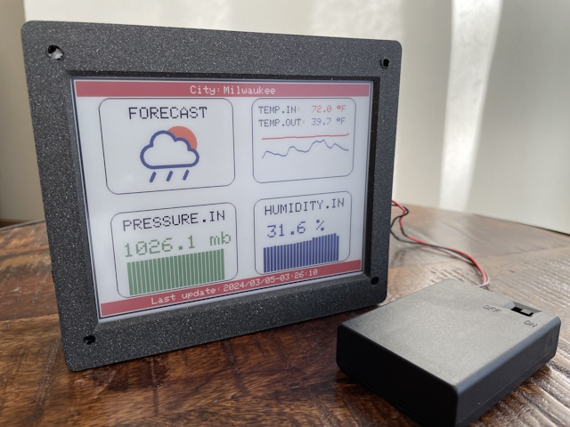

# E-Paper Weather Station V2

## Description

This is a modified version of an existing project of Nick Koumaris. 
The project uses a 6 color e-paper display (600x448 pixels) from InkPlate 
(now Soldered) to display the weather forecast and indoor temperature, humidity, 
and pressure. His original project is availbale here: 

[Arduino Color E Paper Weather Station](https://github.com/educ8s/Arduino-Color-E-Paper-Weather-Station)

The main changes I made are the following:

1. I replaced writing data to EEPROM with writing into the SD-Card. The InkPlate 
display  - which is really a small development board with an Espressif ESP32-WROVER-E
microcontroller and a micro-SD card slot - can use a micro-SD card as well.
The reason for not writing into EEPROM is that a typical EEPROM memory has a 
specified life of 100,000 write/erase cycles; and, I have read before that this
number might be actually smaller. So, given that the initial project writes once per hour
data into EEPROM (that makes 24 h x 365 days = 8,760 times/year), we risk of 
losing the InkPlate display in 10 years or less. Writing into the micro-SD card
might be a better approach, as replacing the micro-SD card woudl be a matter of
just a few dollars. Replacing the InkPlate e-paper display would cost around $130.

2. I retrieve from openweathermap.org also the temperature outside and print it
on the e-paper display too, in addition to the weather forecast. This is done every
four hours now (original project does it every 6 hours).

3. In addition, I print on the e-paper display: i) the name of the city, at the top 
and ii) the date and time of last update of the forecast, at the bottom of the display.

4. I reorganized a bit the code in the main program. I also created a 3D printed 
half-enclosure to protect the indoor sensors - this also helps making the display 
more stable.

This is how the final design looks like:

## Basic Steps to Replicate this Project

### Step 1

Connect the pressure sensor (BMP180) and the himidity and temperature sensor (DHT22)
to a small breadboard. Then, glue with the help of double side sticky tape the breadboard
to the back of the InkPlate original 3D printed case. Use jumper wire to connect the sensors
to the selected pins of the InPlate board - as shown in the figure below (and as 
also discussed in the comments inside the code). You will have to cut a portion of the
back side of the InkPlate original 3D printed case to be able to attach teh jumper wires.
Connect also the battery to the dedicated connector on the board.

### Step 2

Insert a micro-SD card. Before using the card you must first create several empty .txt files
and save them on the card. You should do that on your own laptop/computer, which I assume has 
a card reader. The empty files that you must create should have the following names:
data.txt, weatherid.txt, city.txt, dateandtime.txt, and bootupcount.txt.

### Step 3 (Optional)

Using a 3D printer, print the additional half-enclosure, which then can be easily attached
with the help of plastic screws on the the InkPlate board (will require driling holes into
the four corners of the back side of the InkPlate original 3D printed case).
The photo below shows the project after that is done. 

### Step 4

Open the Arduino sketch in your Arduino IDE, and edit it to provide your own specific values for:
char *ssid     = "Your-WiFi-Router-Name"; 
char *password = "Your-Password"; 
char *APIKEY   = "Key-You-Get-From-openweathermap";
char *cityID   = "Your-City-Number-ID"; // This is 5263045 for Milwaukee, USA
Then, compile and program the InkPlate/Soldered board. If all good, you should
see the e-paper display showing for the first time your weather forecast.

## Youtube Video

I create a youtube video to showcase this project and highlight some of the main 
aspects about the source code. Check it out here:

[youtube video](https://www.youtube.com/watch?v=4-IhC7Kmzh4)

## Original Design

As I said, this is a modified version of an existing project of Nick Koumaris. 
His original project is availbale here, on github, and on his website: 

1. [Arduino Color E Paper Weather Station - on github](https://github.com/educ8s/Arduino-Color-E-Paper-Weather-Station)

2. [Arduino Color E Paper Weather Station - on Nick's website](https://educ8s.tv/arduino-e-paper-weather-station/)
